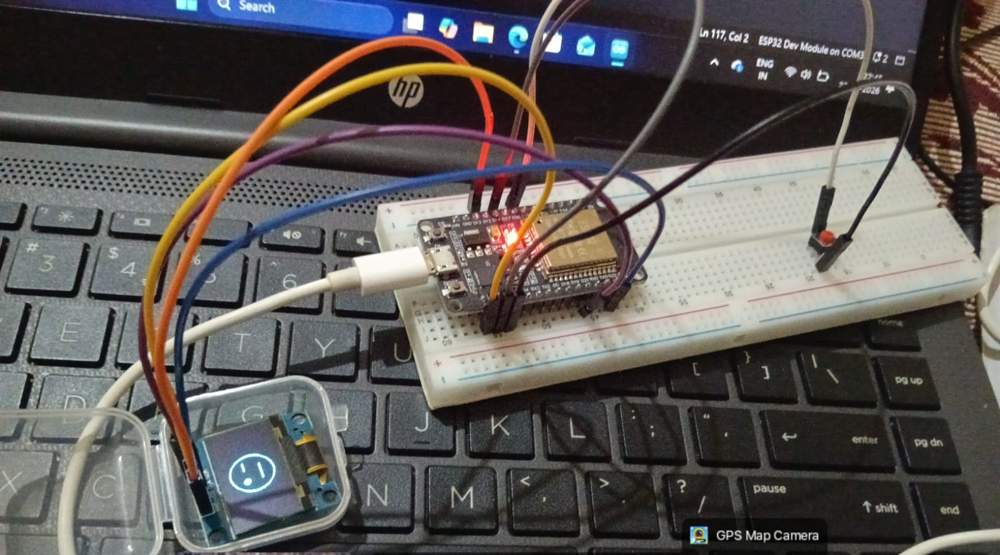
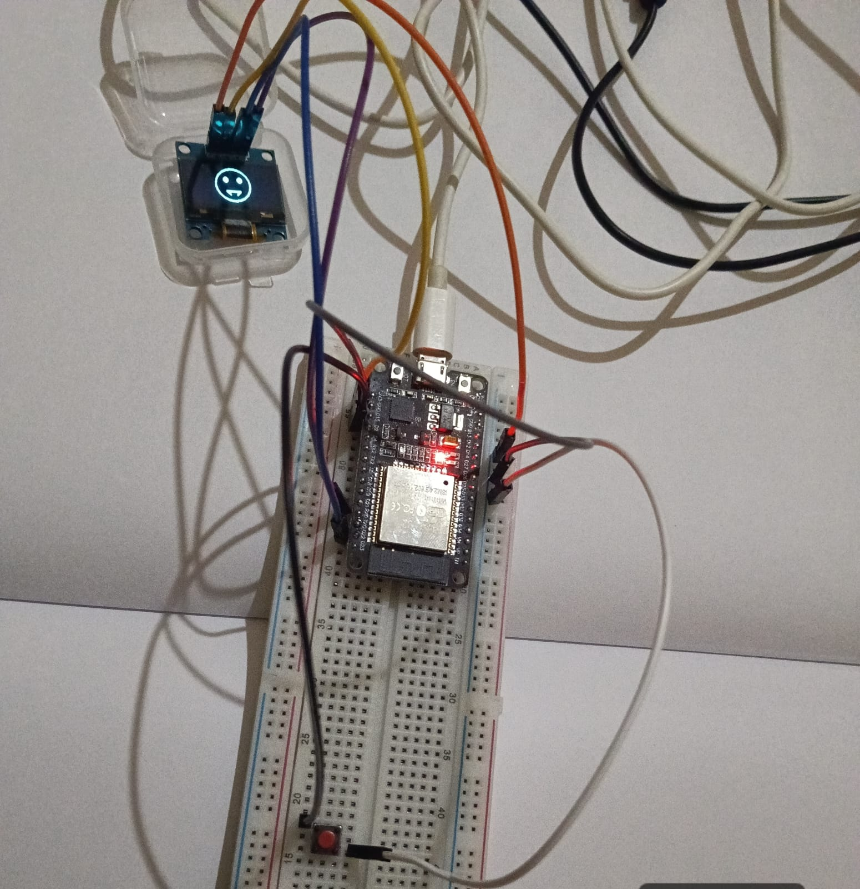
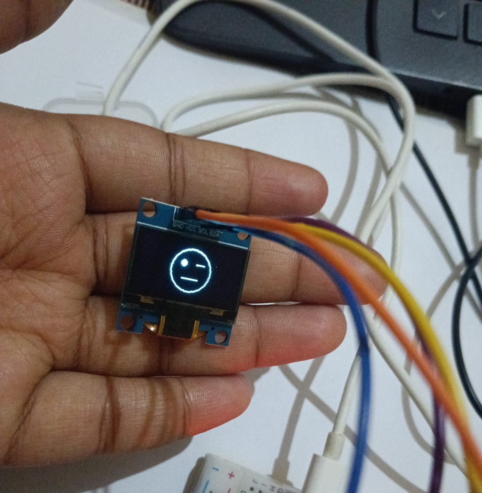

# ESP32 OLED Emoji Display

## Overview

This project is an ESP32-based OLED Emoji Display that displays different facial expressions on a 128×64 SSD1306 OLED screen.

A push button is used to switch between six different emoji expressions. The project was first developed and tested using Wokwi simulation and then implemented and tested on a physical breadboard prototype.

## Objective

The objective of this project is to understand:

- ESP32 GPIO programming
- I²C communication
- OLED display interfacing
- Push-button input handling
- Basic embedded C/C++ programming
- Hardware prototyping and testing

## Components Used

- ESP32 Development Board
- 128×64 SSD1306 OLED Display
- Push Button
- Breadboard
- Jumper Wires

## Software and Libraries

- Arduino IDE
- Wokwi Simulator
- Adafruit GFX Library
- Adafruit SSD1306 Library

## Circuit Connections

### OLED Display

| OLED Pin | ESP32 Pin |
|----------|-----------|
| VCC      | 3.3V      |
| GND      | GND       |
| SDA      | GPIO 21   |
| SCL      | GPIO 22   |

### Push Button

| Button Connection | ESP32 |
|-------------------|-------|
| Input             | GPIO 15 |
| Other terminal    | GND |

The push button is configured using the internal `INPUT_PULLUP` resistor.

## OLED Configuration

- Display: SSD1306
- Resolution: 128×64 pixels
- Communication: I²C
- I²C Address: `0x3C`
- SDA: GPIO 21
- SCL: GPIO 22

## How It Works

When the ESP32 starts, the OLED display is initialized using I²C communication.

The push button is connected to GPIO 15. Each button press changes the current emoji state.

The project contains six different expressions:

1. Happy
2. Sad
3. Surprised
4. Wink
5. Angry
6. Laugh

The program uses separate functions to draw each expression on the OLED display.

The display automatically updates whenever the button is pressed.

## Project Files

- `sketch.ino` – Main ESP32 program
- `diagram.json` – Wokwi circuit configuration
- `libraries.txt` – Libraries required for the Wokwi simulation
- `images/` – Photos of the physical prototype and OLED output
- `DEMO/` – Working demonstration video

## Wokwi Simulation

The project was first designed and tested using the Wokwi online simulator.

[Open Wokwi Simulation](PASTE_YOUR_WOKWI_LINK_HERE)

## Physical Prototype

After testing the circuit in Wokwi, the project was implemented using an ESP32, SSD1306 OLED display, push button, breadboard, and jumper wires.

The physical prototype was tested successfully and the OLED displayed the different emoji expressions when the button was pressed.

## Project Photos

### Physical Prototype

### OLED Display

### Circuit and Working Output

## Working Demonstration

A video demonstration of the working physical prototype is included below.

[Watch the Working Demonstration](DEMO/ESP32_minivid.mp4)

## Results

The ESP32 successfully controls the SSD1306 OLED display and switches between six different emoji expressions using a push button.

The project was successfully tested in both:

- Wokwi simulation
- Physical breadboard prototype

## Future Improvements

Possible improvements include:

- Adding more emoji expressions
- Adding animation effects
- Adding multiple buttons for different controls
- Implementing smoother button debouncing
- Adding additional sensors or inputs
- Creating a more interactive OLED user interface

## Skills Demonstrated

- ESP32
- Embedded C/C++
- GPIO Programming
- I²C Communication
- OLED Interfacing
- Push Button Interfacing
- Arduino IDE
- Wokwi Simulation
- Breadboard Prototyping
- Hardware Testing
